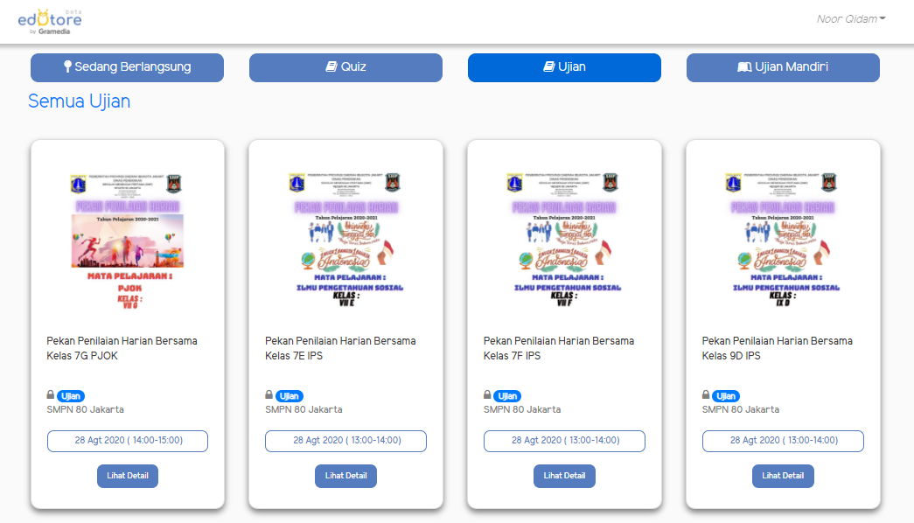

# Edutore Tryout

Edutore Tryout is an online exam platform with multiple choice and essay features and there are quizzes that can be done in real-time so participants can see each other's scores. After the exam is complete, participants can immediately see the grades and can also be sent via email.

## Product

1. Quiz

   > **Feature Quiz**

   - All
     - participants can view and send test results to their respective emails after the quiz ends

   1. Realtime Quiz Questions
      - Quiz that runs with questions sent in real time to the user
   1. Quiz race questions
      - Quiz that runs simultaneously or independently with additional user ratting views

2. Ujian

   > **Feature Exam**

   - All
     - participants can view and send test results to their respective emails after the exam ends

   1. Joint Exam
      - Exams that run simultaneously with the question and can also add an exam session
   1. Independent Exam
      - Exams that can only be done when the participant has made a payment to the organizer who will later have access

   > **Feature All**

   - participants can view and change the profile
   - participants can view the history of exams, quizzes, module transactions, subscription transactions from the Edutore.com platform
   - participants can view a collection of modules and a collection of subscriptions from the Edutore.com platform

## Why Edutore Tryout ?

- because it makes it easier for teachers and students to administer exams and quizzes, and the results of the exam can be known immediately after the exam ends
- This platform is also responsive so students don't have to use a laptop or PC, just use a cellphone with a stable internet connection
- The teacher can make questions directly in the CMS Tryout Edutore menu where only the teachers will be given access rights

## Tech Stack

- Nuxt Js
- CSS
- Bootstrap Vue UI Component
- Moment Js
- Firebase
- Socket.io Client
- Express Js
- MongoDB
- MySQL

## ScreenShoot

 

## Deploy

- [https://tes.edutore.com/](https://tes.edutore.com/)

## Support Me :)

- Star this repository :star:
- Hire Me https://www.linkedin.com/in/noorqidam

## Contact

- WA/TELEGRAM: +62 8577 1603 597
- email: noorqidam@gmail.com
